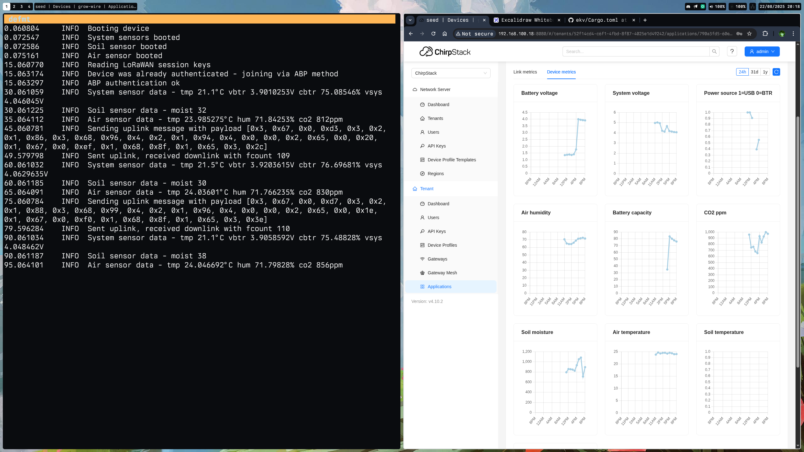

# Preview




# Overview

This is a POC project that implements a LoRaWAN sensor node using the SX1262 transceiver and RP2040 microcontroller, leveraging the Embassy framework for efficient, asynchronous embedded programming.
The node collects data from air (temperature, humidity, CO2) and soil (temperature, moisture) sensors, encodes and transmits it over LoRaWAN.

# Prerequisites

## Hardware

Since this is a embedded project, you need to have some real stuff before starting,
below you will find full list of devices that are needed to build your own set-up.

### Raspberry Pi Pico
Main board to run the project and orchestrate devices

### Raspberry Pi Debug Probe
Debug probe to ease deployment process and give you logs via defmt crate

### SX1262 LoRa Node Module
Transciever that supports LoRa modulation

### SCD41 Sensor
Sensor to read environment parameters such as air tempature, humidity and co2 levels

### SparkFun Soil Moisture Sensor
Sensor to read soil moisture levels

### LoRaWAN Gateway
Gateway which recieves uplink messages and forwards to network server

### LoRaWAN Network Server
Network server that processes uplink messages and acts as authentication server

## Software

### Rust toolchain
```shell
curl --proto '=https' --tlsv1.2 -sSf https://sh.rustup.rs | sh
```
* install targets from rust-toolchain.toml

### Embedded Toolkit (probe-rs)
```shell
curl -LsSf https://github.com/probe-rs/probe-rs/releases/latest/download/probe-rs-tools-installer.sh | sh
```
* update udev rules according to installation guide

# Getting Started

## Install
  ```shell
  git clone https://github.com/nanobreaker/sx1262-rp2040-embassy.git
  ```

## Build
  ```shell
  cargo build
  ```

## Deploy
  ```shell
  cargo embed
  ```

## Wiring

Diagram below shows you how to connect sensors and debug probe to pico

<div style="margin-top: 2rem" align="center">
    <picture>
      <source media="(prefers-color-scheme: dark)" srcset="wiring-dark.png">
      
    </picture>
</div>

## Project Structure

- device
  - mod.rs
- sensor
  - mod.rs
  - system_sensor.rs
  - soil_sensor.rs
  - air_sensor.rs
- storage
  - mod.rs
  - flash_storage.rs
- radio
  - mod.rs
  - lora_radio.rs
- config
  - mod.rs
- main.rs

# License

The code in this project is licensed under MIT license. Check [LICENSE](LICENSE.md) for further
details.
