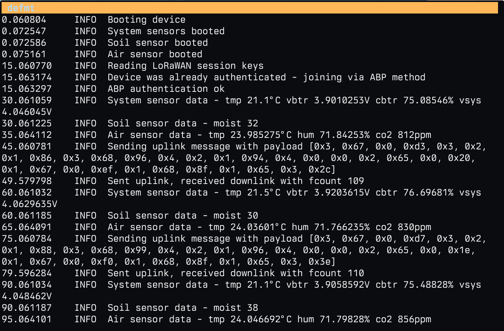
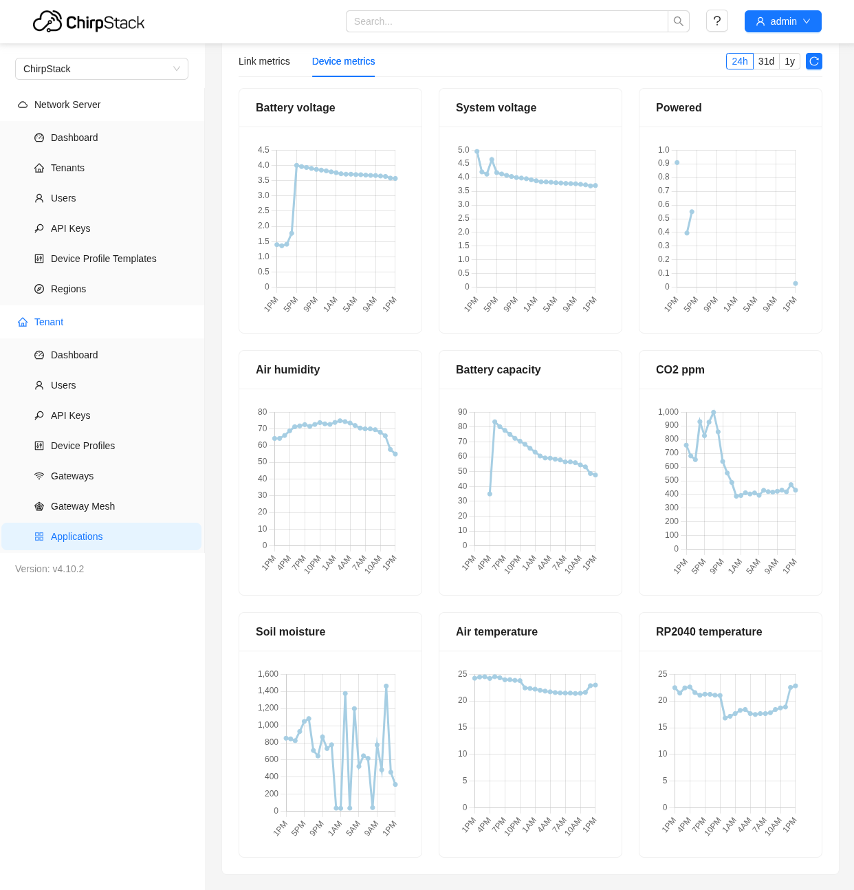
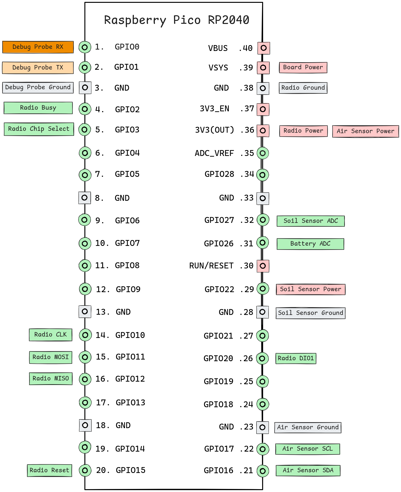

# Preview


# Overview

This is a POC project that implements a LoRaWAN sensor node using the SX1262 transceiver and RP2040 microcontroller, leveraging the Embassy framework for efficient, asynchronous embedded programming.
The node collects data from air (temperature, humidity, CO2) and soil (temperature, moisture) sensors, encodes and transmits it over LoRaWAN.

# Prerequisites

## Hardware

Since this is a embedded project, you need to have some real stuff before starting,
below you will find full list of devices that are needed to build your own set-up.

### Raspberry Pi Pico
Main board to run the project and orchestrate sensors.

[pishop.us](https://www.pishop.us/product/raspberry-pi-pico-h-pre-soldered-headers/?searchid=0&search_query=raspberry+pico)

Costs 5$

### Raspberry Pi Debug Probe
Debug probe to ease deployment process and give you logs via defmt crate

[pishop.us](https://www.pishop.us/product/raspberry-pi-debug-probe/?searchid=0&search_query=debug+probe)

Costs 13.20$



### SX1262 LoRa Node Module
Transciever that supports LoRa modulationc

[waveshare.com](https://www.waveshare.com/pico-lora-sx1262-868m.htm)

Costs 15$

### SCD41 Sensor
Sensor to read environment parameters such as air tempature, humidity and co2 levels

[adafruit.com](https://www.adafruit.com/product/5190)
[shop.pimoroni.com](https://shop.pimoroni.com/products/scd41-co2-sensor-breakout?variant=39652270833747)

Costs 50$

> [!tip]
> if you don't really care about true co2 levels take any other cheap sensor

### SparkFun Soil Moisture Sensor
Sensor to read soil moisture levels

[sparkfun.com](https://www.sparkfun.com/sparkfun-soil-moisture-sensor.html)

Costs 7$

### LoRaWAN Gateway
Gateway which recieves uplink messages and forwards to network server.
You can build one using raspberry pi 3b+ with hat module,
I guess this one of the cheepest options you can get right now on market.
Additionally you can install network server on it.

#### Raspberry Pi 3 B+
[sparkfun.com](https://www.sparkfun.com/raspberry-pi-3-b.html)

Costs 35$

#### RAK5146 Gateway Concentrator Module

[store.rakwireless.com](https://store.rakwireless.com/products/wislink-concentrator-module-sx1303-rak5146-lorawan?srsltid=AfmBOopdwYmrBhz46WgJuNBcYRA39p_mSg0xEG7W_agAIl1T6sN6sCb5&variant=44502223978694)

Costs 83$ 

#### RAK2287/5146 Pi Hat
[store.rakwireless.com](https://store.rakwireless.com/products/rak2287-pi-hat?srsltid=AfmBOopF8PZMeJChOep0DyKDOSFDAUBnppkuZjseyyHE1D7t9IkgtM0_)

Costs 19$ 

> [!note]
> The final costs is around 230$, but worth it if you plan to embedded tinkering.

## Software

### LoRaWAN Network Server
Network server that processes uplink messages and acts as authentication server.
I highly recommend using Chirpstack solution, just simply grab their Gateway OS and install it on gateway.

[chirpstack.io](https://www.chirpstack.io/docs/)



### Rust toolchain

```shell
curl --proto '=https' --tlsv1.2 -sSf https://sh.rustup.rs | sh
```

> [!important]
> install targets from rust-toolchain.toml

### Embedded Toolkit (probe-rs)

```shell
curl -LsSf https://github.com/probe-rs/probe-rs/releases/latest/download/probe-rs-tools-installer.sh | sh
```

> [!important]
> update udev rules according to probe-rs installation guide

# Getting Started

Well now, when you have all the hardware connected with each other and gateway ready to recieve uplink messages we can run our project on pico.

## Install
  ```shell
  git clone https://github.com/nanobreaker/sx1262-rp2040-embassy.git
  ```

## Build
  ```shell
  cargo build
  ```

## Deploy
  ```shell
  cargo embed
  ```

## Wiring

Diagram below shows you how to connect sensors and debug probe to pico

<div style="margin-top: 2rem" align="center">
    <picture>
      <source media="(prefers-color-scheme: dark)" srcset="wiring-dark.png">
      
    </picture>
</div>

## Project Structure

- device
  - mod.rs
- sensor
  - mod.rs
  - system_sensor.rs
  - soil_sensor.rs
  - air_sensor.rs
- storage
  - mod.rs
  - flash_storage.rs
- radio
  - mod.rs
  - lora_radio.rs
- config
  - mod.rs
- main.rs

# License

The code in this project is licensed under MIT license. Check [LICENSE](LICENSE.md) for further
details.
