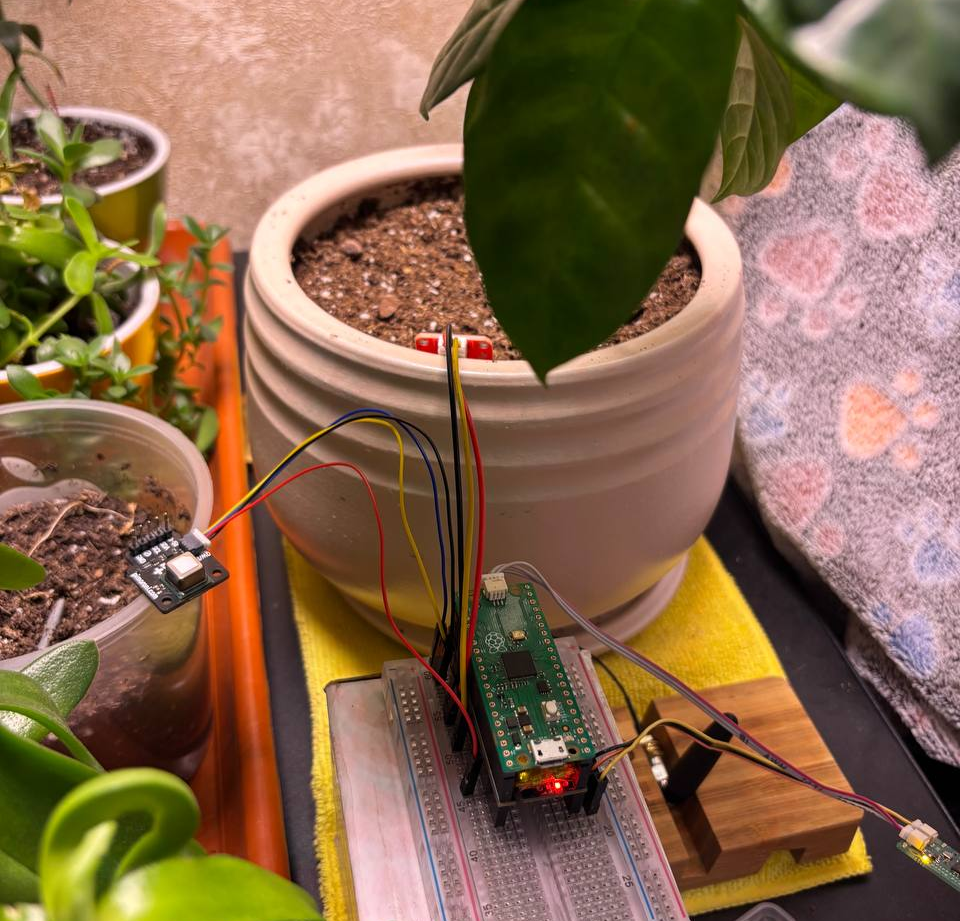

# Preview



# Overview

This project implements a LoRaWAN sensor node using the SX1262 transceiver and RP2040 microcontroller, leveraging the Embassy framework for efficient, asynchronous embedded programming.
The node collects data from air (temperature, humidity, CO2) and soil (temperature, moisture) sensors, encodes and transmits it over LoRaWAN.

# Prerequisites
- Raspberry Pi Pico (RP2040-based board)
- SX1262 LoRa module
- I2C sensors for air and soil data
- Rust toolchain with `thumbv6m-none-eabi` target
- `probe-rs` for flashing and debugging
- LoRaWAN network server (e.g., ChirpStack) for gateway and device management

# Getting Started

## Installation
1. Clone the repository:
  ```bash
  git clone https://github.com/nanobreaker/sx1262-rp2040-embassy.git
  cd sx1262-rp2040-embassy
  ```
2. Set up the Rust environment:
  ```bash
  rustup target add thumbv6m-none-eabi
  ```
3. Build the project:
  ```bash
  cargo build
  ```

## Usage
1. **Configure Sensors**: Update `config.rs` with your I2C addresses and LoRaWAN credentials.
2. **Run the Application**: After flashing, the device will automatically start collecting sensor data and sending uplinks over LoRaWAN.
   ```bash
   cargo embed
   ```

## Project Structure

- device
  - mod.rs
- sensor
  - mod.rs
  - system_sensor.rs
  - soil_sensor.rs
  - air_sensor.rs
- storage
  - mod.rs
  - flash_storage.rs
- radio
  - mod.rs
  - lora_radio.rs
- config
  - mod.rs
- main.rs
- error.rs

# License

The code in this project is licensed under MIT license. Check [LICENSE](LICENSE.md) for further
details.
